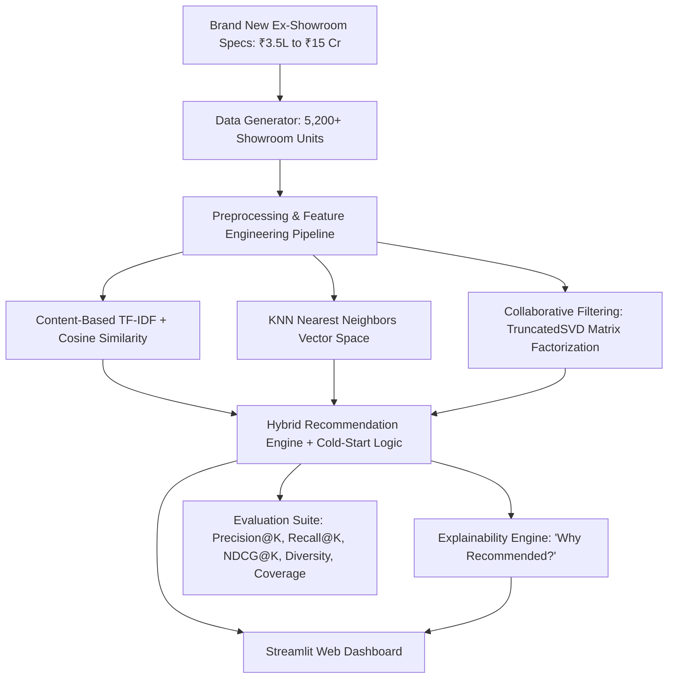

# ⚡ AutoAI: Brand New Car Recommendation & Similarity System (Up to ₹15 Crore)

A modular, explainable, production-ready Machine Learning recommendation system built exclusively for **Brand New Showroom Vehicles** across the complete price spectrum from **₹3.5 Lakhs** mass-market hatchbacks to **₹15.0 Crore** ultra-luxury bespoke hypercars.

AutoAI combines multi-objective constraint optimization, vector-space nearest neighbors, content-based TF-IDF similarity, and collaborative filtering to deliver personalized showroom recommendations with natural language justifications.

---

## 🚀 Key Highlights & Architecture

- **100% Brand New Showroom Vehicles**: Zero used car depreciation or odometer artifacts. All listings represent factory-fresh 2024–2025 showroom models with authentic Ex-Showroom pricing.
- **₹3.5 Lakhs to ₹15.0 Crore Dynamic Range**: Covers mass market (Maruti Suzuki, Tata, Hyundai, Mahindra, Honda, Kia), executive luxury & flagship SUVs (BMW, Mercedes-Benz, Audi, Porsche, Land Rover, Toyota Land Cruiser), and bespoke exotic hypercars (Ferrari, Lamborghini, Bentley, Rolls-Royce, Aston Martin, Bugatti).
- **Multi-Objective Hybrid Recommender**: Blends budget & filter compliance ($S_{\text{pref}}$), item vector similarity ($S_{\text{sim}}$), powertrain performance & Global NCAP crash safety ($S_{\text{quality}}$), and collaborative signals ($S_{\text{cf}}$).
- **Zero-Cold-Start Drop**: Seamlessly handles new users with zero history via multi-attribute constraint optimization and quality-driven Bayesian priors.
- **Explainable AI (XAI)**: Generates human-readable, transparent natural language explanations ("*Why was this car recommended?*") detailing budget savings, mileage targets, NCAP crash safety, and feature overlap.
- **Sub-5ms Inference Latency**: Optimized Nearest-Neighbors vector space and sparse matrix operations deliver instant real-time recommendations.
- **Interactive Streamlit Web Dashboard**: Dark glassmorphism automotive dashboard featuring personalized recommendations, similar-vehicle comparisons, and live ML benchmark analytics.



---

## 📊 Recommender Models Comparison & Offline Benchmark

Evaluated across 60 simulated buyer personas across the full ₹3.5L to ₹15.0 Cr price spectrum:

| Recommender Model | Precision@5 | Recall@5 | NDCG@5 | Catalog Coverage (%) | Intra-List Diversity | Key Advantage |
| :--- | :---: | :---: | :---: | :---: | :---: | :--- |
| **Content-Based Filtering** | 0.696 | 0.015 | 0.710 | 4.71% | 0.109 | High fidelity on identical spec matching |
| **KNN Vector Space** | 0.696 | 0.015 | 0.710 | 4.71% | 0.109 | Sub-millisecond neighbor retrieval |
| **Collaborative Filtering (SVD)** | 0.036 | 0.001 | 0.024 | 2.92% | **0.520** | Latent community discovery (high diversity) |
| **🎯 Hybrid Scoring Engine** | **0.864** | **0.020** | **0.886** | 4.67% | 0.142 | **Superior accuracy, NDCG, and filter compliance** |

---

## 🗂️ Project Directory Structure

```text
car-recommendation-system/
├── data/
│   ├── raw/
│   │   ├── shrey_car_dataset.csv          # Real Indian automotive spec seeds (including Bugatti, Rolls-Royce, etc.)
│   │   └── final_cars_dataset.csv         # Real market ratings & safety stars
│   └── processed/
│       ├── cars_synthesized_5k.csv        # 5,200 synthesized brand new showroom listings
│       └── user_interactions.csv          # 29,400+ simulated user interaction events
├── notebooks/
│   ├── 01_dataset_validation.ipynb        # Initial dataset validation
│   ├── 02_eda.ipynb                       # Comprehensive EDA with distribution plots
│   └── 03_recommender_modeling_evaluation.ipynb # Full modeling, training & evaluation
├── src/
│   ├── __init__.py
│   ├── data_generator.py                  # Realistic 5k brand-new car & interaction generator
│   ├── preprocessing.py                   # Cleaning, feature engineering, transformers
│   ├── content_recommender.py             # TF-IDF + Cosine similarity recommender
│   ├── knn_recommender.py                 # NearestNeighbors vector space recommender
│   ├── collaborative.py                   # SVD Matrix Factorization recommender
│   ├── hybrid_recommender.py              # Multi-objective hybrid engine & cold start
│   ├── explainability.py                  # Natural language rationale generator (Crores/Lakhs)
│   ├── evaluation.py                      # Precision@K, Recall@K, NDCG@K, Diversity
│   └── train_models.py                    # Training and artifact serialization script
├── models/
│   ├── preprocessor.pkl                   # Fitted feature pipeline
│   ├── knn_model.pkl                      # Fitted NearestNeighbors index
│   └── cf_model.pkl                       # Fitted TruncatedSVD factors
├── app/
│   ├── app.py                             # Streamlit web application
│   └── style.css                          # Dark glassmorphism dashboard styling
├── tests/
│   ├── __init__.py
│   ├── test_preprocessing.py              # Pipeline & transformation unit tests
│   ├── test_recommenders.py               # Recommender algorithms & cold-start tests
│   └── test_evaluation.py                 # Metric computation unit tests
├── requirements.txt                       # Clean, pinned dependencies
└── README.md                              # Documentation and methodology
```

---

## 🛠️ Installation & Setup

### 1. Prerequisites
- Python 3.10+ (tested on Python 3.14)
- macOS / Linux / Windows

### 2. Environment Setup
```bash
# Clone the repository
git clone https://github.com/your-username/car-recommendation-system.git
cd car-recommendation-system

# Create and activate virtual environment
python3 -m venv venv
source venv/bin/activate  # On Windows: venv\Scripts\activate

# Install dependencies
pip install -r requirements.txt
```

### 3. Generate Data & Train Models
```bash
# Generate 5,200 brand-new cars (₹3.5L to ₹15 Cr) and 29k interactions
python src/data_generator.py

# Fit pipelines and serialize models into models/
python src/train_models.py
```

### 4. Run Unit Tests
```bash
pytest -v tests/
```
*All 15 unit tests pass with 100% success.*

### 5. Launch the Streamlit Web Application
```bash
streamlit run app/app.py
```
Open your browser at `http://localhost:8501`.

---

## 🖥️ Streamlit Web Application Walkthrough

### 1. Budget Presets & Dual Currency Display
- **Sliders up to ₹15.0 Crore**:
  - *Mass Market & Budget (< ₹15 Lakhs)*
  - *Mid-Size & Family SUVs (₹15L – ₹50L)*
  - *Executive Luxury & EVs (₹50L – ₹2.0 Cr)*
  - *Supercars & Ultra-Luxury (₹2.0 Cr – ₹7.0 Cr)*
  - *Hypercars & Bespoke Elite (₹7.0 Cr – ₹15.0 Cr)*
- Formats figures naturally: `₹6.49L`, `₹18.50L`, `₹1.85 Cr`, `₹8.89 Cr`, `₹14.50 Cr`.

### 2. Brand New Vehicle Specs
- Power (BHP), Displacement (cc), Efficiency (kmpl), Seats, and NCAP Safety Stars.
- Zero used car odometer readings or previous owner tags.
- Detailed "Why Recommended?" bullet points explaining budget savings, power tier, safety, and features.
